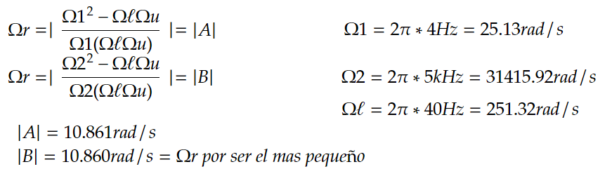
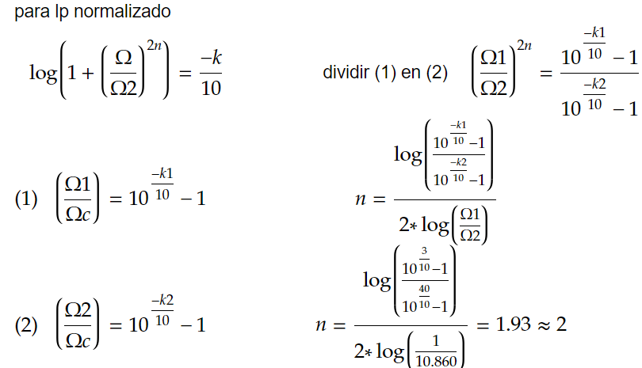

# Laboratorio 3: Filtro Butterworth

Este repositorio contiene el código y la documentación relacionados con el diseño e implementación de un **filtro Butterworth** para el filtrado de señales provenientes del dispositivo **AD8232**, utilizado para el monitoreo de señales ECG (electrocardiograma). El objetivo principal es diseñar un **filtro pasabanda** que, posteriormente, se transforma en un **filtro pasabajo**, mejorando la calidad de la señal al eliminar el ruido no deseado.

## Descripción del Proyecto

El **AD8232** es un bloque integrado especializado para el monitoreo de señales biológicas como el ECG, diseñado para extraer, amplificar y filtrar señales de baja amplitud. Para mejorar la calidad de las señales y eliminar el ruido, se utiliza un filtro Butterworth que se ajusta de pasabanda a pasabajo. En esta implementación, se permite inicialmente el paso de señales dentro de un rango de frecuencias (filtro pasabanda), pero se ajusta para permitir solo el paso de frecuencias bajas (filtro pasabajo), eliminando así las frecuencias más altas no deseadas.

### Filtro Butterworth

El **filtro Butterworth** es ampliamente utilizado en aplicaciones de procesamiento de señales biológicas debido a su respuesta en frecuencia suave y controlada. Se caracteriza por:

- **Respuesta plana en la banda de paso**: El filtro no presenta ondulaciones en la banda de paso, lo que es crucial para mantener la integridad de señales sensibles como las de ECG y EEG.
- **Atenuación progresiva**: En la banda de corte, la atenuación se incrementa de manera gradual, evitando transiciones abruptas que podrían distorsionar la señal.

Estas propiedades hacen que el filtro Butterworth sea una elección popular en la instrumentación médica y aplicaciones de señal biológica.

### Parámetros del Filtro

Los parámetros del filtro fueron seleccionados de acuerdo con las especificaciones del AD8232 y las necesidades del sistema:

- **Atenuación de -3 dB** a 40 Hz y 500 Hz.
- **Atenuación de -40 dB** entre 4 Hz y 5 kHz.

Estas especificaciones permiten capturar adecuadamente las señales ECG, reduciendo el ruido en las frecuencias fuera del rango de interés.

### Diseño del Filtro

1. **Filtro Pasabanda**: En la primera etapa, se diseña un filtro pasabanda que permite el paso de frecuencias entre 40 Hz y 500 Hz, atenuando tanto las frecuencias bajas como las muy altas. A continuación, se muestra la gráfica de la respuesta en frecuencia del filtro pasabanda:

   *Figura 1: Respuesta en frecuencia del filtro pasabanda.*

2. **Cálculo de Ωr**: Para la transformación de pasabanda a pasabajo, es necesario calcular el valor de Ωr utilizando las siguientes ecuaciones:

  

   *Figura 2: Cálculo de Ωr mediante las ecuaciones necesarias.*

3. **Filtro Pasabajo**: Con el valor de Ωr calculado, se ajusta el diseño del filtro para convertirlo en un filtro pasabajo normalizado. Este filtro permite una mejor eliminación de las frecuencias no deseadas, enfocándose en el rango de interés más bajo para mejorar la calidad de la señal ECG. A continuación, se muestra la gráfica del filtro pasabajo:

  

   *Figura 3: Respuesta en frecuencia del filtro pasabajo.*

4. **Cálculo del Orden del Filtro**: Para determinar el orden adecuado del filtro, es necesario realizar cálculos que aseguren una correcta atenuación y un rendimiento óptimo en la filtración de la señal. El orden del filtro determina la complejidad y la precisión del filtrado. A continuación, se muestra la ecuación utilizada para calcular el orden:

  
   *Figura 4: Cálculo del orden del filtro Butterworth.*

### Análisis de Resultados

Para analizar las señales, se tomó una muestra de 60 segundos con un total de 180,000 muestras, que se separaron utilizando el método de la ventana de Hanning. Esta es una función de ventana utilizada en el procesamiento de señales y análisis espectral, que se aplica a señales temporales antes de realizar transformaciones como la Transformada de Fourier, con el fin de reducir el efecto de discontinuidad en los bordes de la señal.

#### Hipótesis Nula y Alternativa

- **Hipótesis Nula (H₀)**: No hay efecto o cambio, es decir, "no hay diferencia en la media de la frecuencia antes y después del tratamiento".
- **Hipótesis Alternativa (H₁)**: Hay un efecto o cambio, es decir, "hay una diferencia en la media de la frecuencia antes y después del tratamiento".

### Resultados

Los resultados obtenidos son los siguientes:

- **Número de muestras utilizadas**: 180,000
- **Duración de la señal**: 60.00 segundos

**Frecuencias Dominantes y Medias por Ventana:**

| Ventana | Media Frecuencia Dominante (Hz) | Frecuencia Media (Hz) | Desviación Estándar (Hz) |
|---------|---------------------------|------------------------|---------------------------|
| 591     | 110.00                    | 107.23                 | 53.22                     |
| 592     | 110.00                    | 114.08                 | 57.88                     |
| 593     | 110.00                    | 112.57                 | 54.32                     |
| 594     | 110.00                    | 114.35                 | 53.18                     |
| 595     | 70.00                     | 116.05                 | 87.37                     |
| 596     | 70.00                     | 102.30                 | 69.40                     |
| 597     | 80.00                     | 106.10                 | 73.92                     |
| 598     | 80.00                     | 100.91                 | 65.68                     |
| 599     | 80.00                     | 87.70                  | 34.41                     |
| 600     | 90.00                     | 178.94                 | 154.03                    |

#### Análisis de las Frecuencias

- **Frecuencia Dominante**: Las ventanas 591 a 594 presentan una frecuencia dominante constante de 110.00 Hz. Sin embargo, hay una caída abrupta a 70.00 Hz en las ventanas 595 y 596, seguida de un aumento a 80.00 Hz en las ventanas 597 y 598, con un último incremento a 90.00 Hz en la ventana 600.
  
- **Frecuencia Media**: Las frecuencias medias muestran una tendencia a aumentar, pero presentan variaciones significativas, especialmente en la ventana 600, donde la frecuencia media (178.94 Hz) es notablemente más alta que en las ventanas anteriores.
  
- **Desviación Estándar**: Las desviaciones estándar varían entre ventanas. Las ventanas 595 y 600 tienen desviaciones estándar altas (87.37 Hz y 154.03 Hz, respectivamente), lo que indica una mayor variabilidad en las frecuencias, sugiriendo más ruido o fluctuaciones en estas ventanas en comparación con las anteriores.

Dado que no se pudo realizar un análisis estadístico formal  y considerando que las frecuencias dominantes y medias mostraron variaciones notables, especialmente en la ventana 600:

- No se puede rechazar H₀ de manera concluyente, ya que no se realizó un análisis adecuado, ya que hicieron falta mas recoleccion de datos.
- Sin embargo, la variabilidad observada, especialmente en la frecuencia media de la ventana 600, sugiere que hay diferencias en los datos que podrían apoyar la hipótesis alternativa (H₁) si tuviéramos más datos o un análisis más detallado.
