# Laboratorio 3: Filtro Butterworth

Este repositorio contiene el código y la documentación relacionados con el diseño e implementación de un **filtro Butterworth** para el filtrado de señales provenientes del dispositivo **AD8232**, utilizado para el monitoreo de señales ECG (electrocardiograma). El objetivo principal es diseñar un **filtro pasabanda** que, posteriormente, se transforma en un **filtro pasabajo**, mejorando la calidad de la señal al eliminar el ruido no deseado.

## Descripción del Proyecto

El **AD8232** es un bloque integrado especializado para el monitoreo de señales biológicas como el ECG, diseñado para extraer, amplificar y filtrar señales de baja amplitud. Para mejorar la calidad de las señales y eliminar el ruido, se utiliza un filtro Butterworth que se ajusta de pasabanda a pasabajo. En esta implementación, se permite inicialmente el paso de señales dentro de un rango de frecuencias (filtro pasabanda), pero se ajusta para permitir solo el paso de frecuencias bajas (filtro pasabajo), eliminando así las frecuencias más altas no deseadas.

## Adquisición de la señal EMG
La señal se adquirió principalmente de tres músculos: el flexor ulnar del carpo, el flexor radial del carpo y el flexor profundo de los dedos. A continuación, se detallará la ubicación de los electrodos como la señal adquirida originalmente sin filtros:

La señal original capturada presenta las siguientes características:
- *Frecuencia de muestreo*: 3000 Hz
- *Tiempo de muestreo*: 333.33 µs. Este valor se calculó a partir de la siguiente fórmula:

- *Duración total de la señal*: 60 segundos, podemos comprobarlo a partir de:

- *Número de contracciones*: 600 contracciones por minuto.

## Aplicación de las ventanas de Hanning 
Elegimos la ventana de Hanning para analizar la señal de electromiografía porque ofrece varias ventajas. Primero, suaviza la señal, lo que reduce las discontinuidades y distorsiones en el análisis de frecuencias, permitiendo una representación más precisa de las componentes de la señal.

Además, la ventana de Hanning mejora la resolución de frecuencias, lo cual es crucial para identificar patrones de activación muscular. Su transición gradual, en comparación con otras ventanas más abruptas, minimiza la alteración de la forma de onda original.

Por último, es especialmente útil para señales con componentes de frecuencia específicas, ya que ayuda a destacar esas frecuencias en el espectro.

En este caso decidimos analizar la ventana 591 porque es una de las ultimas contracciones hechas en el lapso de tiempo en que adquirimos los datos, pues a este punto el musculo estba llegando a la fatiga, hicimos 600 contracciones y por cada una de ellas una vantana de hanning, pero de estas ploteamos las ultimas 10 para visualizar la llegada a la fatiga muscular.

La ventana de Hanning, tiene un propósito específico en el análisis de una contracción muscular:
### 1. Forma de la Ventana:
La ventana de Hanning es una función de suavizado que, en términos visuales, parece una curva suave con los extremos que tienden a cero. Esto reduce el efecto de discontinuidades que podrían estar presentes si la señal se corta abruptamente. Además, hay una oscilación con un crecimiento progresivo hacia un pico central alrededor del tiempo 59.05 s, con amplitudes máximas y mínimas pronunciadas, que luego disminuyen suavemente hacia los lados. Esto es una señal de que la contracción muscular tiene un evento fuerte en ese momento central.
### 2. Tamaño de la Ventana:
En términos de tiempo, cada muestra en la ventana representa un pequeño intervalo de tiempo dentro de esa contracción. Se realizo la toma de 600 contracciones por minuto y por cada contracción se realizo una ventana, la que estamos analizando en la 591 ya que en este punto de está acercando a la fatiga muscular. En cuanto a la amplitud tiene un pico maximo hasta 400 mV y en este punto logramos ver la contración del musculo, el punto en donde esta por llegar a la fatiga.
### 3. Interpretación de la Contracción:
La forma ondulante en la gráfica indica la actividad muscular durante una contracción. Los picos positivos y negativos en la amplitud sugieren que la señal EMG está captando el esfuerzo del músculo al contraerse y relajarse.
El pico central más alto y con mayor amplitud alrededor de los 59.05 s indica el momento máximo de contracción muscular. El hecho de que los picos decrezcan gradualmente sugiere que el músculo se está relajando después de esta contracción máxima.
Esta ventana en particular se está utilizando para enfocar un segmento de la señal de EMG, en el momento más relevante de la contracción muscular.
El objetivo principal de aplicar una ventana de Hanning es evitar el efecto de discontinuidades en los bordes del segmento de señal, para que cuando se analice los resultados sean más precisos y con menos artefactos.
La señal muestra claramente una contracción muscular significativa dentro de este intervalo, destacando el pico máximo de esfuerzo.

A continuacion veremos  la señal antes como después de la convolución: 

Señal Original vs. Señal convolucionada

   *- Señal Original (Azul):*
Esta es la señal inicial con picos de amplitud que llegan a valores cercanos a 400. La señal muestra un patrón oscilante más marcado y con amplitudes altas, lo que sugiere que el músculo tiene una actividad intensa y sin filtrar. Se pueden ver varias oscilaciones fuertes, especialmente en la región de tiempo entre 59.02 s y 59.08 s, lo que refleja la actividad eléctrica captada durante la contracción muscular.

   *- Señal convolucionada (Naranja):*
Al aplicar la ventana de Hanning de tamaño 591, la amplitud de la señal se ha suavizado considerablemente, y ahora los picos están en un rango mucho más bajo (máximos cercanos a 100). La ventana suaviza los bordes de la señal, atenuando las oscilaciones de alta frecuencia y reduciendo el impacto de variaciones bruscas que pueden aparecer en la señal original. Esto es útil para evitar interferencia en el análisis frecuencial posterior. Las oscilaciones en esta señal aún siguen el mismo patrón general que la señal original, pero están más moderadas y redondeadas y así no confundirlo con el ruido de alta frecuencia.

Comparación entre Señales:

*- Forma:*
     - La señal original es más ruidosa, con mayores oscilaciones y picos bruscos. Esto puede deberse a la presencia de componentes de alta frecuencia o artefactos del entorno.
     - La señal con la ventana de Hanning es mucho más suave, preservando la estructura básica, pero eliminando las fluctuaciones rápidas que podrían interferir en un análisis preciso.
   
 *-Tamaño:*
     - La señal original tiene amplitudes mucho más grandes, con picos que alcanzan valores cercanos a 400.
     - La señal con la ventana de Hanning está considerablemente reducida en amplitud, con valores máximos alrededor de 100, lo cual indica que la ventana ha atenuado las oscilaciones más fuertes y centrado la señal en sus componentes más relevantes.

## Análisis espectral 

Analizamos el espectro de frecuencia de la ventana 591, que nos permite deducir cómo está distribuida la energía de la señal en diferentes frecuencias. Observamos un pico fuerte alrededor de 100 Hz, lo que indica que la mayor parte de la energía se concentra en esta frecuencia, un patrón típico en señales de electromiografía, donde la actividad muscular se encuentra generalmente en el rango de 10 Hz a 150 Hz. Después de este pico, la magnitud de la energía decae rápidamente, lo que es consistente con el suavizado aplicado por la ventana de Hanning, que elimina componentes de alta frecuencia no relevantes o ruido. Además, se observan varios picos entre 50 Hz y 150 Hz, lo cual es esperado, ya que este es el rango principal asociado a la actividad muscular. En conjunto, el espectro refleja claramente la concentración de energía en torno a los 100 Hz, característico de la contracción muscular.

En el código también hicimos que para cada contracción con su respectivo analisis espectral nos mostrará frecuencia dominante, frecuencia media y desviación estándar. Para la ventan 591 los resultados fueron:

 *- Frecuencia Dominante de 110 Hz:* Esta es la frecuencia con mayor energía dentro del espectro, lo que significa que la mayor parte de la actividad muscular captada por los electrodos está ocurriendo alrededor de los 110 Hz. Esto es coherente con la gráfica del espectro de frecuencias, donde observamos un pico pronunciado cerca de los 100-110 Hz. Esta frecuencia dominante es típica de las señales EMG, ya que la actividad eléctrica muscular suele estar en el rango de 10 Hz a 150 Hz, como lo dijimos anteriormente.

 *- Frecuencia Media de 107.23 Hz:* La frecuencia media representa el promedio ponderado de todas las frecuencias presentes en el espectro. Esto nos dice que, en promedio, la señal EMG tiene más energía distribuida alrededor de los 107 Hz. Dado que la frecuencia dominante y la media están tan cerca (110 Hz y 107.23 Hz), esto indica que la energía de la señal está bien concentrada en torno a ese rango de frecuencia. El espectro no muestra muchas otras componentes significativas fuera de este rango, lo que sugiere una contracción muscular fuerte y sostenida.

 *- Desviación Estándar de 53.22 Hz:* La desviación estándar de 53.22 Hz indica la dispersión o el ancho del espectro de frecuencias en torno a la media. En este caso, sugiere que hay una cierta cantidad de energía distribuida en frecuencias que se alejan de los 107.23 Hz. Esto es visible en la gráfica del espectro de frecuencias, donde observamos algunas componentes entre 50 Hz y 150 Hz, con una disminución gradual en las frecuencias más altas. La señal no está completamente concentrada en una única frecuencia, lo cual es típico de las señales biológicas que contienen variaciones naturales en las frecuencias.

### Filtro Butterworth

El **filtro Butterworth** es ampliamente utilizado en aplicaciones de procesamiento de señales biológicas debido a su respuesta en frecuencia suave y controlada. Se caracteriza por:

- **Respuesta plana en la banda de paso**: El filtro no presenta ondulaciones en la banda de paso, lo que es crucial para mantener la integridad de señales sensibles como las de ECG y EEG.
- **Atenuación progresiva**: En la banda de corte, la atenuación se incrementa de manera gradual, evitando transiciones abruptas que podrían distorsionar la señal.

Estas propiedades hacen que el filtro Butterworth sea una elección popular en la instrumentación médica y aplicaciones de señal biológica.

### Parámetros del Filtro

Los parámetros del filtro fueron seleccionados de acuerdo con las especificaciones del AD8232 y las necesidades del sistema:

- **Atenuación de -3 dB** a 40 Hz y 500 Hz.
- **Atenuación de -40 dB** entre 4 Hz y 5 kHz.

Estas especificaciones permiten capturar adecuadamente las señales ECG, reduciendo el ruido en las frecuencias fuera del rango de interés.

### Diseño del Filtro

1. **Filtro Pasabanda**: En la primera etapa, se diseña un filtro pasabanda que permite el paso de frecuencias entre 40 Hz y 500 Hz, atenuando tanto las frecuencias bajas como las muy altas. A continuación, se muestra la gráfica de la respuesta en frecuencia del filtro pasabanda:

   *Figura 1: Respuesta en frecuencia del filtro pasabanda.*

2. **Cálculo de Ωr**: Para la transformación de pasabanda a pasabajo, es necesario calcular el valor de Ωr utilizando las siguientes ecuaciones:

  

   *Figura 2: Cálculo de Ωr mediante las ecuaciones necesarias.*

3. **Filtro Pasabajo**: Con el valor de Ωr calculado, se ajusta el diseño del filtro para convertirlo en un filtro pasabajo normalizado. Este filtro permite una mejor eliminación de las frecuencias no deseadas, enfocándose en el rango de interés más bajo para mejorar la calidad de la señal ECG. A continuación, se muestra la gráfica del filtro pasabajo:

  

   *Figura 3: Respuesta en frecuencia del filtro pasabajo.*

4. **Cálculo del Orden del Filtro**: Para determinar el orden adecuado del filtro, es necesario realizar cálculos que aseguren una correcta atenuación y un rendimiento óptimo en la filtración de la señal. El orden del filtro determina la complejidad y la precisión del filtrado. A continuación, se muestra la ecuación utilizada para calcular el orden:

  
   *Figura 4: Cálculo del orden del filtro Butterworth.*

### Análisis de Resultados

Para analizar las señales, se tomó una muestra de 60 segundos con un total de 180,000 muestras, que se separaron utilizando el método de la ventana de Hanning. Esta es una función de ventana utilizada en el procesamiento de señales y análisis espectral, que se aplica a señales temporales antes de realizar transformaciones como la Transformada de Fourier, con el fin de reducir el efecto de discontinuidad en los bordes de la señal.

#### Hipótesis Nula y Alternativa

- **Hipótesis Nula (H₀)**: No hay efecto o cambio, es decir, "no hay diferencia en la media de la frecuencia antes y después del tratamiento".
- **Hipótesis Alternativa (H₁)**: Hay un efecto o cambio, es decir, "hay una diferencia en la media de la frecuencia antes y después del tratamiento".

### Resultados

Los resultados obtenidos son los siguientes:

- **Número de muestras utilizadas**: 180,000
- **Duración de la señal**: 60.00 segundos

**Frecuencias Dominantes y Medias por Ventana:**

| Ventana | Media Frecuencia Dominante (Hz) | Frecuencia Media (Hz) | Desviación Estándar (Hz) |
|---------|---------------------------|------------------------|---------------------------|
| 591     | 110.00                    | 107.23                 | 53.22                     |
| 592     | 110.00                    | 114.08                 | 57.88                     |
| 593     | 110.00                    | 112.57                 | 54.32                     |
| 594     | 110.00                    | 114.35                 | 53.18                     |
| 595     | 70.00                     | 116.05                 | 87.37                     |
| 596     | 70.00                     | 102.30                 | 69.40                     |
| 597     | 80.00                     | 106.10                 | 73.92                     |
| 598     | 80.00                     | 100.91                 | 65.68                     |
| 599     | 80.00                     | 87.70                  | 34.41                     |
| 600     | 90.00                     | 178.94                 | 154.03                    |

#### Análisis de las Frecuencias

- **Frecuencia Dominante**: Las ventanas 591 a 594 presentan una frecuencia dominante constante de 110.00 Hz. Sin embargo, hay una caída abrupta a 70.00 Hz en las ventanas 595 y 596, seguida de un aumento a 80.00 Hz en las ventanas 597 y 598, con un último incremento a 90.00 Hz en la ventana 600.
  
- **Frecuencia Media**: Las frecuencias medias muestran una tendencia a aumentar, pero presentan variaciones significativas, especialmente en la ventana 600, donde la frecuencia media (178.94 Hz) es notablemente más alta que en las ventanas anteriores.
  
- **Desviación Estándar**: Las desviaciones estándar varían entre ventanas. Las ventanas 595 y 600 tienen desviaciones estándar altas (87.37 Hz y 154.03 Hz, respectivamente), lo que indica una mayor variabilidad en las frecuencias, sugiriendo más ruido o fluctuaciones en estas ventanas en comparación con las anteriores.

Dado que no se pudo realizar un análisis estadístico formal  y considerando que las frecuencias dominantes y medias mostraron variaciones notables, especialmente en la ventana 600:

- No se puede rechazar H₀ de manera concluyente, ya que no se realizó un análisis adecuado, ya que hicieron falta mas recoleccion de datos.
- Sin embargo, la variabilidad observada, especialmente en la frecuencia media de la ventana 600, sugiere que hay diferencias en los datos que podrían apoyar la hipótesis alternativa (H₁) si tuviéramos más datos o un análisis más detallado.
  
## Anexos
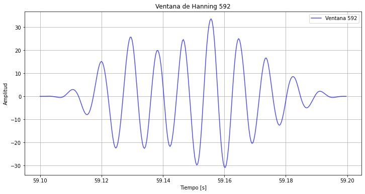
*Figura 5: Ventana Hanning 592.*
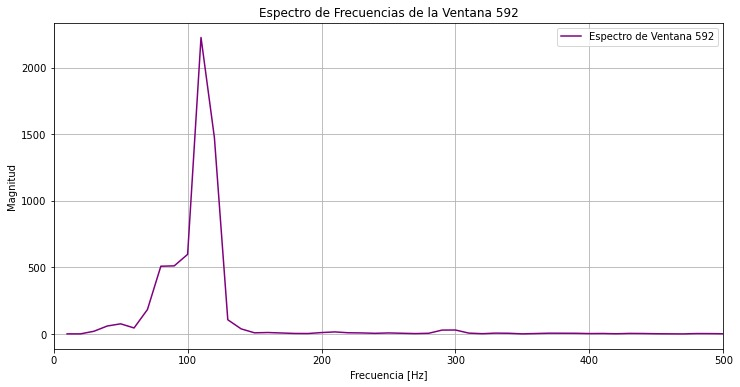
*Figura 6: Espectro de frecuencia de la ventana 592.*

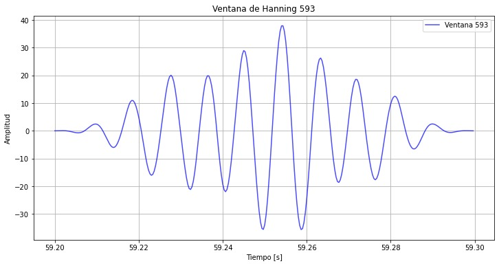
*Figura 7: Ventana Hanning 593.*
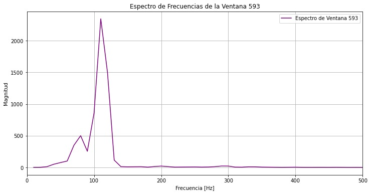
*Figura 8: Espectro de frecuencia de la ventana 593.*

*Figura 9: Ventana Hanning 594.*
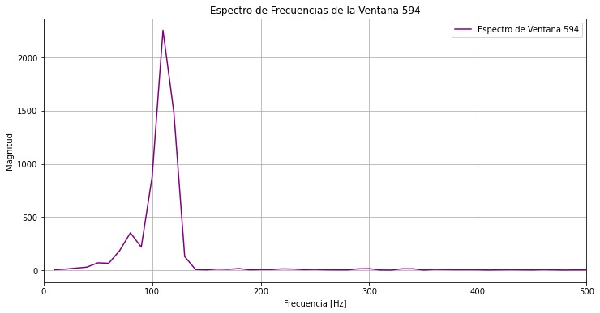
*Figura 10: Espectro de frecuencia de la ventana 594.*

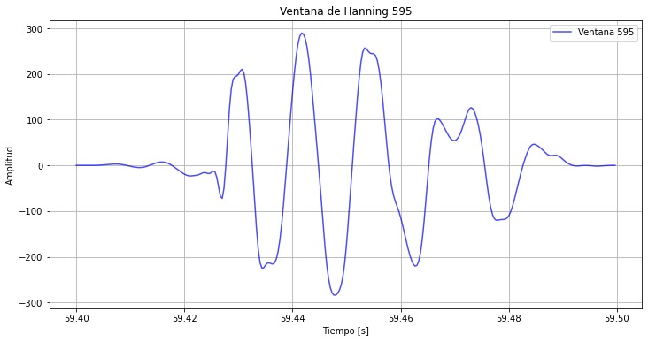
*Figura 11: Ventana Hanning 595.*
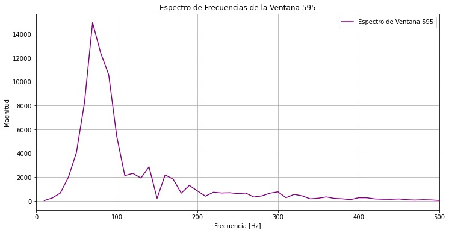
*Figura 12: Espectro de frecuencia de la ventana 595.*

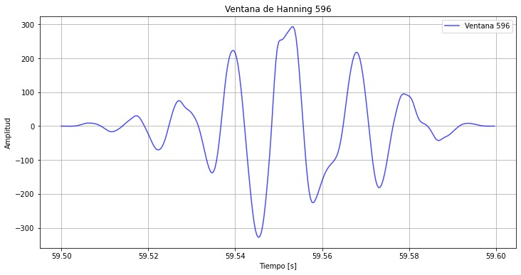
*Figura 13: Ventana Hanning 596.*
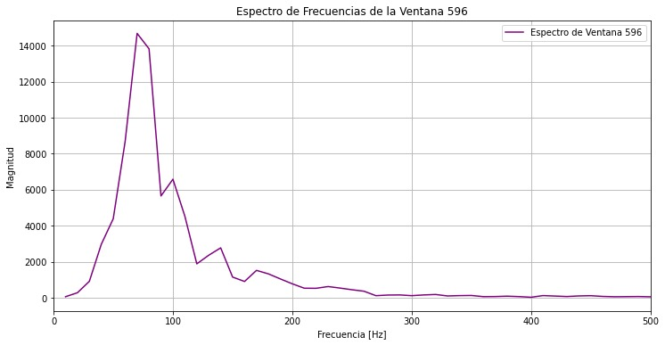
*Figura 14: Espectro de frecuencia de la ventana 596.*

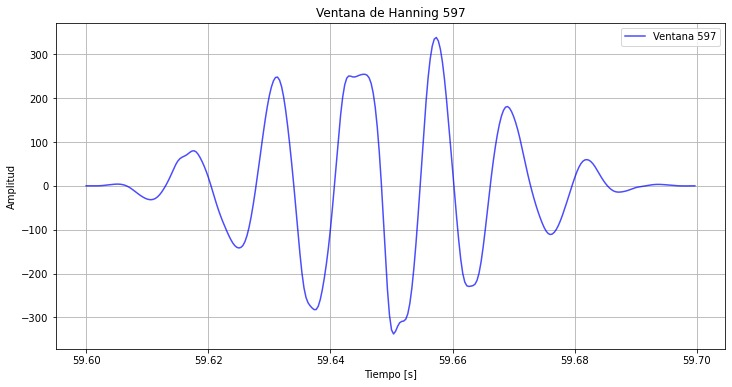
*Figura 15: Ventana Hanning 597.*
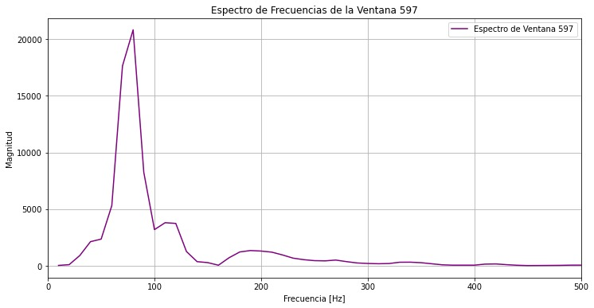
*Figura 16: Espectro de frecuencia de la ventana 597.*

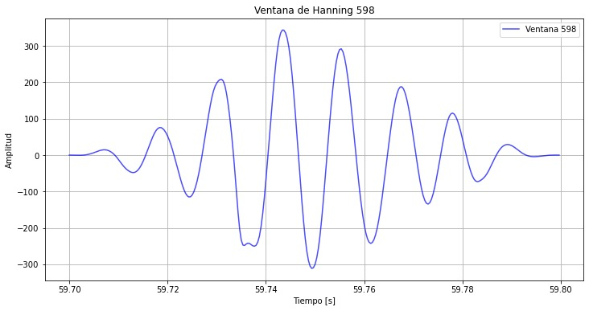
*Figura 17: Ventana Hanning 598.*
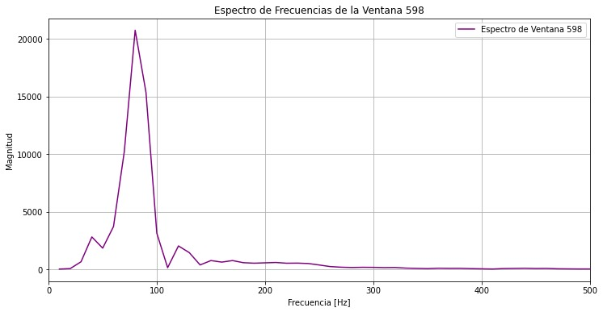
*Figura 18: Espectro de frecuencia de la ventana 598.*

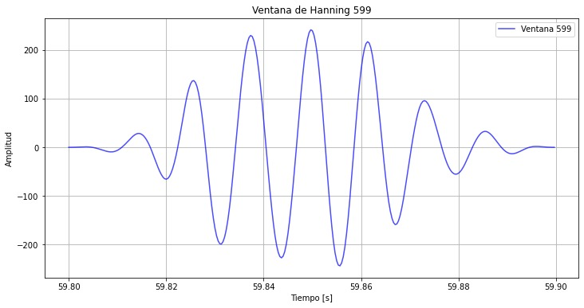
*Figura 19: Ventana Hanning 599.*
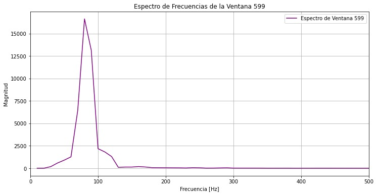
*Figura 20: Espectro de frecuencia de la ventana 599.*

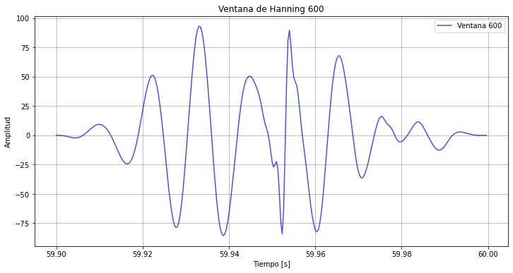
*Figura 21: Ventana Hanning 600.*
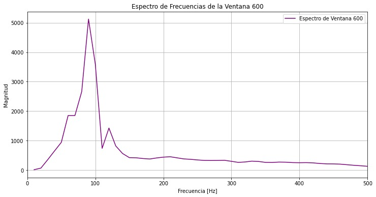
*Figura 22: Espectro de frecuencia de la ventana 600.*
